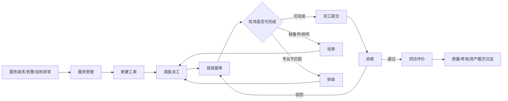

# 一站式服务与工单调度页面契约

## 目标

把一站式服务从“工单卡片展示”推进为可办事的医院后勤核心流程。该模块是医院后勤系统的第一条主干：接收问题、形成工单、调度资源、执行任务、验收评价，并向资产、BIM、物联、质量和考核沉淀数据。

本文只保存脱敏后的产品流程和页面契约，不保存 PPT 原图、客户真实数据、竞品原文或现场资料。

## 来源依据

| 来源 | 采用内容 | 在本模块中的作用 |
| --- | --- | --- |
| 中科医信竞品功能树 | 调度中心、维修管理、移动维修、移动报修、工程仓库、报表、消息 | 决定一站式服务的成熟功能颗粒度和页面流转环节 |
| PPT 后勤功能矩阵 | 一站式服务中心、工单管理、服务评价、空间信息联动、AI/知识库、综合管理上传实绩 | 决定该模块与 BIM 空间、评价、综合管理的关系 |
| 北建院客户数据目录 | 强电、暖通、给排水、医气、环境、医废等系统，以及专业班组、控制室、移动端等角色 | 决定工单来源、专业分类、班组映射和空间/点位字段 |
| AI 工程补齐 | 页面命名、前端骨架、状态提示、测试组织 | 只作为工程衔接，不作为业务功能唯一来源 |

## 用户与职责

| 角色 | 主要职责 | 关注点 |
| --- | --- | --- |
| 报修人/科室 | 提交服务请求、补充现场信息、确认结果和评价 | 提交快、响应可见、结果可信 |
| 一站式服务受理员 | 登记请求、分类定级、补充空间、设备和联系人信息 | 信息完整、分类准确、减少反复沟通 |
| 后勤调度员 | 查看工单池、按 SLA 和班组负载派工、跟踪超时风险 | 工单优先级、班组能力、风险排序、闭环状态 |
| 班组人员 | 接单、到场、挂单、转单、完工和提交处置证据 | 任务清楚、位置清楚、处置记录简单 |
| 管理者 | 验收、驳回、查看服务质量和异常问题 | SLA、满意度、投诉、重复故障、外包履约 |
| 仓库/备件人员 | 根据工单领用备件、回写出入库和成本 | 备件库存、安全库存、领用归集 |

## 主流程

## 状态流转

| 当前状态 | 可执行动作 | 下一状态 | 操作角色 | 必留痕字段 |
| --- | --- | --- | --- | --- |
| 服务请求 | 受理建单 | 新建 | 受理员 | 受理人、来源、分类、空间、联系人 |
| 新建 | 派工 | 已派工 | 调度员 | 派工人、目标班组、SLA、派工说明 |
| 已派工 | 接单 | 处理中 | 班组人员 | 接单人、接单时间、预计到场 |
| 处理中 | 挂单 | 已挂单 | 班组人员 | 挂单原因、所需协同、预计恢复 |
| 处理中 | 转单 | 已转单 | 班组人员/调度员 | 转出班组、目标班组、原因 |
| 处理中 | 完工 | 待验收 | 班组人员 | 完工说明、现场结果、附件/证据 |
| 已挂单 | 重新派工/接单 | 已派工/处理中 | 调度员/班组人员 | 恢复原因、责任班组 |
| 已转单 | 重新派工/接单 | 已派工/处理中 | 调度员/班组人员 | 转单确认、责任班组 |
| 待验收 | 验收通过 | 待评价 | 管理者/报修人 | 验收人、验收结果、验收意见 |
| 待验收 | 驳回 | 处理中 | 管理者/报修人 | 驳回原因、整改要求 |
| 待评价 | 评价 | 已关闭 | 报修人/管理者 | 评分、评价、投诉标记 |
| 非已关闭 | 升级 | 已升级 | 系统/调度员/管理者 | 升级原因、风险级别、处理要求 |

## 页面组信息架构

一站式服务页面组使用统一骨架：

1. 流程导航：服务受理、工单调度、任务执行、验收回访、服务评价。
2. 页面说明：明确当前页面服务哪个角色和哪个业务目标。
3. 筛选工具条：按状态、SLA、专业、空间、来源、班组和关键词筛选。
4. 主列表：展示当前页面最重要的业务对象。
5. 详情面板：展示来源证据、空间/BIM、设备/点位、SLA 和历史。
6. 操作面板：只显示当前状态可执行动作。
7. 流转时间线：保留所有动作、人员、时间和备注。
8. 结果反馈：成功、失败、无权限、冲突、数据更新等状态明确提示。

## 页面契约

### 服务受理

| 字段 | 内容 |
| --- | --- |
| 使用者 | 一站式服务受理员 |
| 业务目标 | 把电话、现场报修、移动报修、告警和巡检异常统一登记为服务请求或工单 |
| 主对象 | 服务请求 |
| 入口来源 | 后勤首页、待办中心、电话记录、移动报修、预警池、巡检异常 |
| 核心操作 | 新建请求、选择服务类型、绑定空间、绑定设备/点位、设置优先级、生成工单 |
| 数据区 | 来源信息、报修人、联系方式、空间/BIM、设备/点位、问题描述、附件、知识推荐 |
| 状态 | 草稿、信息不完整、已生成工单、重复请求提醒 |
| 来源依据 | 中科医信一站式服务、PPT 一站式服务中心、北建院系统和角色字段 |
| 验收流程 | 受理员登记“门诊大厅空调异常”，绑定门诊楼共享大厅，生成待派工单 |

### 工单调度

| 字段 | 内容 |
| --- | --- |
| 使用者 | 后勤调度员 |
| 业务目标 | 在一个工作台内处理工单池、派工建议、SLA 风险、班组负载和调度动作 |
| 主对象 | 工单 |
| 入口来源 | 后勤首页、待办中心、服务受理、预警池、BIM 空间、资产详情 |
| 核心操作 | 筛选、选择工单、查看详情、派工、升级、查看班组建议 |
| 数据区 | 工单池、派工建议、工单详情、SLA 倒计时、BIM 位置、班组负载、流转记录 |
| 状态 | 新建、已派工、已升级、已挂单、已转单、超时风险 |
| 来源依据 | 中科医信调度中心、PPT 工单管理和空间联动、北建院专业系统分类 |
| 验收流程 | 调度员选择医废负压高风险工单，看到 BIM 点位和 SLA 风险后派给环境监管组 |

### 任务执行

| 字段 | 内容 |
| --- | --- |
| 使用者 | 班组人员、外包服务人员 |
| 业务目标 | 明确自己要处理的任务、位置、风险、处置要求，并回写现场过程 |
| 主对象 | 执行任务 |
| 入口来源 | 待办中心、消息、工单调度派工、移动端任务入口 |
| 核心操作 | 接单、到场、补充现场记录、挂单、转单、完工、申请备件 |
| 数据区 | 我的任务、任务详情、空间位置、设备/点位、处置步骤、备件、附件、时间线 |
| 状态 | 待接单、处理中、已挂单、已转单、待验收 |
| 来源依据 | 中科医信移动维修、PPT 综合维修/巡检服务管理、北建院专业班组和端类型 |
| 验收流程 | 暖通班人员接单后记录到场，发现缺备件后挂单，恢复后完工提交 |

### 验收回访

| 字段 | 内容 |
| --- | --- |
| 使用者 | 管理者、报修人、科室联系人 |
| 业务目标 | 判断工单是否真正解决，并将未达标任务退回整改 |
| 主对象 | 待验收工单 |
| 入口来源 | 待办中心、消息、工单详情、后勤首页 |
| 核心操作 | 查看完工说明、验收通过、驳回整改、发起回访 |
| 数据区 | 待验收列表、完工证据、SLA 结果、历史流转、服务对象反馈 |
| 状态 | 待验收、已驳回、待评价 |
| 来源依据 | 中科医信服务闭环、PPT 服务评价和质量管理 |
| 验收流程 | 管理者查看完工证据，因现场未恢复驳回；班组整改后再次提交并通过 |

### 服务评价

| 字段 | 内容 |
| --- | --- |
| 使用者 | 报修人、科室、后勤管理者 |
| 业务目标 | 把服务结果沉淀为满意度、投诉、服务品质和考核依据 |
| 主对象 | 已关闭工单和评价记录 |
| 入口来源 | 验收回访、消息、服务品质页面 |
| 核心操作 | 评分、填写评价、标记投诉、生成整改项、查看服务品质指标 |
| 数据区 | 待评价工单、评分维度、投诉问题、班组表现、SLA 达成、服务趋势 |
| 状态 | 待评价、已评价、投诉待处理、整改中 |
| 来源依据 | 中科医信服务品质、PPT 质量体系、考核管理和满意度评价 |
| 验收流程 | 科室对已完成维修给出低分，系统生成服务品质问题并进入整改跟踪 |

## 与其他模块的边界

| 模块 | 输入/输出关系 |
| --- | --- |
| 资产台账 | 工单可绑定资产；完工结果回写维修履历和健康度 |
| 巡检保养 | 巡检异常可转工单；计划工单进入任务执行 |
| 物联告警 | 高风险告警可转工单；工单处置结果回写告警闭环 |
| BIM 空间 | 工单必须能定位到楼栋、楼层、房间或 BIM 构件 |
| 仓库备件 | 挂单和完工可关联备件申请、领用和成本归集 |
| 服务品质 | SLA、评价、投诉、驳回和重复工单进入质量考核 |
| 综合管理 | 服务过程数据支撑合同、考核、结算和运营分析 |

## 前端验收标准

1. 页面不是长页堆叠，进入一站式服务后能看到五个流程页签。
2. 工单调度页必须有工单列表、详情面板、操作面板和流转时间线。
3. 当前页面标题和说明必须告诉用户“这个页面用来办什么事”。
4. 点击工单后能看到来源、空间/BIM、SLA、班组建议和允许动作。
5. 派工、接单、挂单、转单、完工、验收、评价至少在 mock 流程里能改变状态并写入时间线。
6. 移动宽度下不出现横向溢出，核心操作入口仍可见。

## 后续数据库推导

数据库设计应从以下对象开始，而不是先做孤立表：

- `ServiceRequest`：服务请求和受理信息。
- `WorkOrder`：工单主记录。
- `WorkOrderTransition`：状态流转审计。
- `DispatchAssignment`：派工和班组责任。
- `WorkOrderEvidence`：现场附件、完工说明、验收证据。
- `ServiceEvaluation`：评价、投诉和满意度。
- `SlaPolicy`：响应、到场、完工、升级规则。
- `TeamWorkload`：班组能力、负载和值班状态。

## 下一步工程任务

1. 为一站式服务页面组新增前端 E2E 测试，先让测试失败。
2. 改造 `web/src/App.tsx`，增加五个流程页签和稳定页面骨架。
3. 改造 `web/src/App.css`，让工单调度页成为密集但清晰的业务工作台。
4. 验证 `npm run lint`、`npm run build`、`npm run test:e2e`。
5. 再进入数据库/API 缺口分析，不在页面契约未稳定前先建表。
