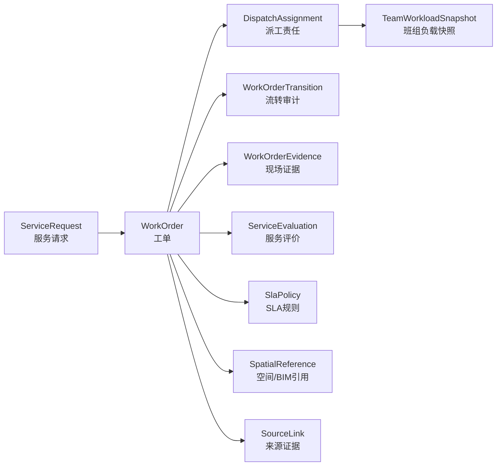

# 一站式服务领域模型与数据库设计

## 目标

本文把一站式服务与工单调度的页面契约继续向下推导为领域对象、数据库表边界、API 数据契约和下一步落库计划。设计服务于真实医院后勤闭环：服务受理、工单调度、任务执行、验收回访、服务评价，以及后续与资产、BIM、物联、仓库、质量、合同和考核的联动。

本文只保存脱敏后的模型和表结构，不保存客户真实数据、原始 PPT、竞品原文或现场资料。

## 架构决策

### ADR-001：一站式服务先作为整洁单体内的垂直业务模块

**状态：** 已接受。

**背景：** 当前系统处于从 0 到 1 的核心业务闭环建设期，重点是稳定领域模型、状态流转、页面契约和测试。过早拆分微服务会增加部署、事务、测试和调试复杂度。

**决策：** 一站式服务使用现有 .NET 分层结构继续演进：Domain 定义领域对象和状态机，Application 组织用例和内存/数据库仓储接口，Api 暴露 REST 合约，Infrastructure 负责后续 PostgreSQL 适配。

**取舍：**
- 正向：模型统一、事务简单、测试快、适合当前快速纠偏。
- 负向：未来多院区高并发和多系统集成时，需要按 IntegrationHub、WorkOrder、Asset、Iot 等边界拆分。

### ADR-002：工单流转必须作为审计事件独立保存

**状态：** 已接受。

**背景：** 医院后勤工单涉及 SLA、外包履约、质量考核、投诉处理和责任追溯。只在工单主表保存当前状态，无法支撑过程审计。

**决策：** 每一次派工、接单、挂单、转单、完工、验收、驳回、评价、升级都写入 `wo_work_order_transitions`。主表只保存当前状态和关键汇总字段。

**取舍：**
- 正向：可审计、可复盘、可做质量考核和合同结算。
- 负向：查询详情时需要聚合主表和时间线，应用层需要处理并发和幂等。

### ADR-003：引入“待评价”状态修正现有状态机缺口

**状态：** 下一轮实现。

**背景：** 页面契约要求“完工 -> 验收 -> 评价 -> 关闭”。当前代码和 `docs/09-work-order-dispatch-vertical-slice.md` 中验收通过后回到 `处理中`，这是 V1 内存纵切的简化，不适合长期模型。

**决策：** 后续领域模型增加 `PendingEvaluation`。目标状态机为：`New -> Dispatched -> InProgress -> PendingAcceptance -> PendingEvaluation -> Closed`，并保留 `Suspended`、`Transferred`、`Escalated` 作为分支状态。

**取舍：**
- 正向：流程语义更清楚，前端验收回访和服务评价页面能自然承接。
- 负向：需要同步更新后端枚举、状态机测试、前端类型和 API 返回值。

## 领域边界

## 聚合与对象

| 聚合/对象 | 责任 | 关键字段 | 不负责 |
| --- | --- | --- | --- |
| `ServiceRequest` | 承接人工报修、电话受理、移动报修、告警和巡检异常 | 请求编号、来源、报修人、联系方式、空间、设备/点位、描述、附件、受理状态 | 不保存工单流转历史 |
| `WorkOrder` | 表达可调度、可执行、可验收的任务主记录 | 工单号、标题、服务类型、优先级、状态、空间、设备/点位、责任班组、SLA 截止 | 不保存每次操作细节 |
| `DispatchAssignment` | 表达派工结果和责任归属 | 工单、目标班组、调度员、派工说明、是否当前责任 | 不替代班组主数据 |
| `WorkOrderTransition` | 保存状态变化审计事件 | 动作、前状态、后状态、操作人、时间、备注、评分 | 不作为当前状态来源 |
| `WorkOrderEvidence` | 保存现场证据和附件元数据 | 类型、文件引用、说明、采集人、采集时间 | 不保存真实文件二进制 |
| `ServiceEvaluation` | 保存满意度、投诉和质量反馈 | 评分、评价、投诉标记、整改要求、评价人 | 不承担合同结算计算 |
| `SlaPolicy` | 配置响应、到场、完工、升级规则 | 服务类型、优先级、响应分钟、完工分钟、升级策略 | 不保存单个工单结果 |
| `TeamWorkloadSnapshot` | 保存派工时的班组负载视图 | 班组、专业、活动任务数、容量、建议说明、快照时间 | 不作为实时排班系统 |
| `SourceLink` | 保留来源追溯 | 来源类型、来源编号、来源摘要、非 AI 来源标记 | 不保存原始内部资料 |
| `SpatialReference` | 统一空间和 BIM 关联 | 院区、楼栋、楼层、房间、BIM 构件、空间标签 | 不做 BIM 建模工具 |

## 状态机

| 状态 | 含义 | 可进入页面 | 可执行动作 |
| --- | --- | --- | --- |
| `New` | 已生成待派工工单 | 工单调度 | 派工、升级 |
| `Dispatched` | 已指定责任班组 | 工单调度、任务执行 | 接单、转单、升级 |
| `InProgress` | 班组已接单并处理中 | 任务执行 | 挂单、转单、完工、升级 |
| `Suspended` | 因备件、协同或现场条件暂停 | 工单调度、任务执行 | 重新派工、接单、升级 |
| `Transferred` | 已转给其他班组或待确认 | 工单调度、任务执行 | 重新派工、接单、升级 |
| `PendingAcceptance` | 班组已完工，等待验收 | 验收回访 | 验收通过、驳回 |
| `PendingEvaluation` | 验收通过，等待评价 | 服务评价 | 评价、投诉 |
| `Closed` | 已评价或确认闭环 | 服务评价、服务品质 | 查看、复盘 |
| `Escalated` | SLA 或风险触发升级 | 工单调度、管理者待办 | 派工、接单、关闭前不可忽略 |

## 数据库表设计

所有表都需要保留：

- `id`：内部主键，建议 UUID。
- `hospital_code`：院区或租户标识，V1 可用 mock 固定值。
- `created_at`、`created_by`、`updated_at`、`updated_by`。
- `row_version`：并发控制。
- `is_deleted`：软删除，审计类表默认不允许删除。

### `wo_service_requests`

| 字段 | 类型建议 | 说明 |
| --- | --- | --- |
| `request_no` | varchar(40), unique | 服务请求编号 |
| `source_type` | varchar(40) | 电话、移动报修、告警、巡检异常、BIM 空间 |
| `source_ref` | varchar(80), nullable | 来源系统或事件编号 |
| `requester_name` | varchar(80) | 报修人或科室联系人 |
| `requester_department` | varchar(120), nullable | 科室或部门 |
| `contact_phone_masked` | varchar(40), nullable | 脱敏联系电话 |
| `service_type` | varchar(80) | 维修、保洁、配送、医废、医气等 |
| `priority` | varchar(20) | Low、Normal、High、Critical |
| `description` | text | 问题描述 |
| `status` | varchar(30) | Draft、Accepted、Converted、Cancelled |
| `spatial_ref_id` | uuid, nullable | 空间引用 |
| `asset_ref_id` | uuid, nullable | 资产引用 |
| `iot_point_ref_id` | uuid, nullable | 点位引用 |
| `converted_work_order_id` | uuid, nullable | 生成的工单 |

### `wo_work_orders`

| 字段 | 类型建议 | 说明 |
| --- | --- | --- |
| `work_order_no` | varchar(40), unique | 工单编号 |
| `request_id` | uuid, nullable | 来源服务请求 |
| `title` | varchar(200) | 工单标题 |
| `service_type` | varchar(80) | 服务类型 |
| `priority` | varchar(20) | 优先级 |
| `status` | varchar(30) | 当前状态 |
| `responsible_team_id` | uuid, nullable | 当前责任班组 |
| `responsible_person_id` | uuid, nullable | 当前执行人 |
| `spatial_ref_id` | uuid, nullable | 空间/BIM 关联 |
| `asset_ref_id` | uuid, nullable | 设备资产 |
| `iot_point_ref_id` | uuid, nullable | 监测点位 |
| `sla_policy_id` | uuid, nullable | 使用的 SLA 策略 |
| `sla_due_at` | timestamptz | SLA 截止时间 |
| `accepted_at` | timestamptz, nullable | 接单时间 |
| `completed_at` | timestamptz, nullable | 完工时间 |
| `accepted_for_review_at` | timestamptz, nullable | 验收通过时间 |
| `closed_at` | timestamptz, nullable | 闭环时间 |

### `wo_work_order_transitions`

| 字段 | 类型建议 | 说明 |
| --- | --- | --- |
| `work_order_id` | uuid | 工单 |
| `action` | varchar(40) | Dispatch、Accept、Suspend、Transfer、Complete、AcceptCompletion、RejectCompletion、Evaluate、Escalate |
| `from_status` | varchar(30) | 前状态 |
| `to_status` | varchar(30) | 后状态 |
| `operator_id` | uuid, nullable | 操作人 |
| `operator_name` | varchar(80) | 操作人快照 |
| `operator_role` | varchar(80), nullable | 角色快照 |
| `remark` | text | 备注 |
| `target_team_id` | uuid, nullable | 转单或派工目标 |
| `rating` | int, nullable | 评价分 |
| `occurred_at` | timestamptz | 发生时间 |

### `wo_dispatch_assignments`

| 字段 | 类型建议 | 说明 |
| --- | --- | --- |
| `work_order_id` | uuid | 工单 |
| `team_id` | uuid | 班组 |
| `dispatcher_id` | uuid, nullable | 调度员 |
| `dispatch_reason` | text | 派工原因 |
| `is_current` | boolean | 是否当前责任 |
| `assigned_at` | timestamptz | 派工时间 |
| `accepted_at` | timestamptz, nullable | 接单时间 |
| `released_at` | timestamptz, nullable | 被转出或结束时间 |

### `wo_work_order_evidence`

| 字段 | 类型建议 | 说明 |
| --- | --- | --- |
| `work_order_id` | uuid | 工单 |
| `evidence_type` | varchar(40) | Photo、Document、Reading、Voice、Text |
| `file_ref` | varchar(200), nullable | 附件或对象存储引用 |
| `summary` | text | 证据说明 |
| `captured_by` | varchar(80) | 采集人快照 |
| `captured_at` | timestamptz | 采集时间 |

### `wo_service_evaluations`

| 字段 | 类型建议 | 说明 |
| --- | --- | --- |
| `work_order_id` | uuid, unique | 工单 |
| `evaluator_name` | varchar(80) | 评价人快照 |
| `evaluator_department` | varchar(120), nullable | 科室 |
| `rating` | int | 1-5 分 |
| `comment` | text, nullable | 评价内容 |
| `is_complaint` | boolean | 是否投诉 |
| `rectification_required` | boolean | 是否需要整改 |
| `evaluated_at` | timestamptz | 评价时间 |

### `wo_sla_policies`

| 字段 | 类型建议 | 说明 |
| --- | --- | --- |
| `policy_code` | varchar(60), unique | 策略编号 |
| `service_type` | varchar(80) | 服务类型 |
| `priority` | varchar(20) | 优先级 |
| `response_minutes` | int | 响应时限 |
| `arrival_minutes` | int | 到场时限 |
| `completion_minutes` | int | 完工时限 |
| `escalation_minutes` | int | 升级阈值 |
| `enabled` | boolean | 是否启用 |

### `wo_team_workload_snapshots`

| 字段 | 类型建议 | 说明 |
| --- | --- | --- |
| `team_id` | uuid | 班组 |
| `team_name` | varchar(120) | 班组名称快照 |
| `domain` | varchar(80) | 专业域 |
| `active_tasks` | int | 活动任务数 |
| `capacity` | int | 当班容量 |
| `recommendation` | text | 派工建议 |
| `snapshot_at` | timestamptz | 快照时间 |

### `wo_source_links`

| 字段 | 类型建议 | 说明 |
| --- | --- | --- |
| `work_order_id` | uuid | 工单 |
| `source_kind` | varchar(40) | PPT、北建院、中科医信、Iot、Inspection、Bim、Manual |
| `source_ref` | varchar(100), nullable | 来源编号或类型 |
| `source_summary` | text | 脱敏摘要 |
| `is_ai_supplement` | boolean | 是否仅为 AI 工程补齐 |

### `twin_spatial_refs`

该表后续应由 BIM/空间模块统一拥有。一站式服务只通过外键或只读引用使用。

| 字段 | 类型建议 | 说明 |
| --- | --- | --- |
| `campus` | varchar(120) | 院区 |
| `building` | varchar(120) | 楼栋 |
| `floor` | varchar(40) | 楼层 |
| `room` | varchar(120) | 房间 |
| `bim_element_id` | varchar(120), nullable | BIM 构件 |
| `functional_area` | varchar(120), nullable | 功能区 |

## API 数据契约

| 页面 | API/用例 | 需要的数据 |
| --- | --- | --- |
| 服务受理 | `POST /api/operations/service-requests` | 来源、联系人、空间、设备/点位、服务类型、优先级、描述 |
| 服务受理 | `POST /api/operations/service-requests/{requestNo}/convert` | 生成工单并返回工单详情 |
| 工单调度 | `GET /api/operations/dispatch-board` | 工单池、派工建议、SLA 风险、班组负载 |
| 工单调度 | `POST /api/operations/work-orders/{workOrderNo}/dispatch` | 目标班组、调度员、派工说明 |
| 任务执行 | `POST /api/operations/work-orders/{workOrderNo}/transition` | 接单、挂单、转单、完工动作和现场备注 |
| 验收回访 | `POST /api/operations/work-orders/{workOrderNo}/acceptance` | 验收通过或驳回、验收意见 |
| 服务评价 | `POST /api/operations/work-orders/{workOrderNo}/evaluation` | 评分、评价、投诉标记、整改要求 |

## 前端页面契约映射

| 前端面板 | 主数据源 | 必须稳定返回的字段 |
| --- | --- | --- |
| 服务受理 | `ServiceRequestDraft` | 来源、空间、服务类型、优先级、描述、转换结果 |
| 工单池 | `DispatchBoard.workOrders` | 工单号、标题、优先级、状态、位置、责任班组、SLA |
| 派工建议 | `DispatchBoard.recommendations` | 推荐班组、原因、剩余分钟、优先级 |
| 工单详情 | `WorkOrderDetail` | 工单、空间、来源证据、SLA 风险、允许动作 |
| 流转记录 | `WorkOrderDetail.timeline` | 时间、操作人、动作、前后状态、备注、评分 |
| 任务执行 | `WorkOrderExecutionView` | 我的任务、现场步骤、备件需求、允许动作 |
| 验收回访 | `AcceptanceReviewView` | 待验收工单、完工证据、SLA 结果、驳回记录 |
| 服务评价 | `ServiceEvaluationView` | 待评价工单、评分维度、投诉、服务品质指标 |

## 非功能要求

| 要求 | 设计约束 |
| --- | --- |
| 审计 | 流转表不可物理删除；关键动作必须留操作人、时间、前后状态 |
| 并发 | 工单状态更新使用 `row_version` 或等价乐观锁 |
| 幂等 | 服务请求转工单、评价提交、派工动作要避免重复生成 |
| 数据安全 | 联系方式脱敏保存；附件只保存引用，不把敏感文件提交仓库 |
| 可追溯 | `wo_source_links` 保留非 AI 来源标记和脱敏摘要 |
| 集成 | BIM、资产、IoT、仓库、质量走外键或适配引用，不在工单模块重做主数据 |
| 可测试 | 状态机、仓储、API 合约、前端流程都必须有回归测试 |

## 与当前代码的差距

| 差距 | 当前状态 | 下一步 |
| --- | --- | --- |
| `PendingEvaluation` 状态 | 当前枚举缺失，验收通过后语义不清 | 更新 Domain、Application 测试、前端类型 |
| 服务请求对象 | 当前前端用本地 mock 直接生成工单 | 后端新增 `ServiceRequest` 和转换用例 |
| 持久化 | 当前内存仓储 | 引入仓储接口和 PostgreSQL 适配计划 |
| 证据与评价 | 当前只有时间线和简单评分字段 | 新增 Evidence、Evaluation 模型 |
| 幂等 | 前端做了简单去重 | 后端用请求编号和唯一约束保证 |

## 下一步实现顺序

1. 先更新领域状态机：增加 `PendingEvaluation`，修正验收通过和评价流转。
2. 新增 `ServiceRequest`、`ServiceRequestConversionResult` 和转换用例。
3. 为服务请求转工单写后端单元测试和 API 测试。
4. 前端从 mock 生成工单改为优先调用 API，API 不可用时保留本地 fallback。
5. 再设计 PostgreSQL/EF Core 迁移，不在状态机和 API 稳定前直接建库。
